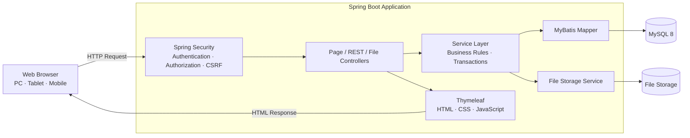
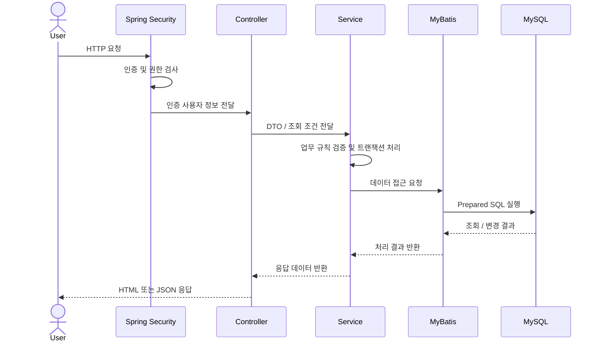
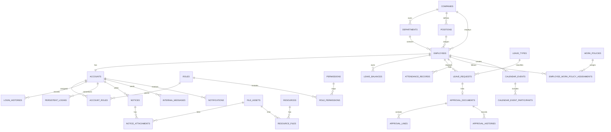
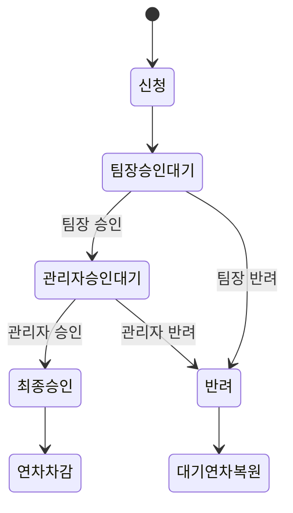

# Workly Office Manager

사원·조직·연차·전자결재·근태·공지·자료실·일정을 하나의 흐름으로 관리하는 **사내 업무관리 웹 애플리케이션**입니다.

Spring Boot 기반의 서버 사이드 렌더링과 REST API를 함께 구성했으며, 역할 기반 접근 제어, 순차 결재, 파일 보안, 감사 로그, Excel 입출력 등 실제 업무 시스템의 핵심 요구사항을 구현했습니다.

> Portfolio Project · Backend / Full-stack Web Development

## 배포

> http://3.26.172.214/login

## 주요 기능

- 관리자·팀장·사원의 역할과 권한에 따른 화면 및 데이터 접근 제어
- 사원·부서·직급 CRUD와 부서/직급별 사내 구성원 조회
- 사원 검색·필터·페이징 및 Excel 일괄 등록·다운로드
- 연차 잔여일 관리와 `팀장 → 관리자` 순차 승인
- 일반 전자결재, 승인·반려 의견, 첨부파일 및 처리 이력
- 출퇴근 기록과 근무시간·지각·조퇴 계산
- 공지사항, 자료실, 일정, 사내 쪽지, 알림, 통합 검색
- 다크 모드와 PC·태블릿·모바일 반응형 UI
- Swagger/OpenAPI 문서와 Actuator Health Check

## 기술 스택

| 영역 | 적용 기술 |
|---|---|
| Language | Java 17 |
| Backend | Spring Boot 4.0.7, Spring MVC |
| Security | Spring Security, Method Security, BCrypt, CSRF, Session, Remember Me |
| Persistence | MyBatis 4.0.1, Spring JDBC, HikariCP |
| Database | MySQL 8, InnoDB |
| Frontend | Thymeleaf, HTML5, CSS3, Vanilla JavaScript |
| API | REST API, Bean Validation, springdoc OpenAPI / Swagger UI |
| File / Excel | Multipart File Upload, Apache POI 5.5.1 |
| Monitoring | Spring Boot Actuator |
| Test / Build | JUnit 5, MockMvc, Gradle |

## 시스템 아키텍처



### 요청 처리 흐름



## 핵심 ERD

현재 애플리케이션 코드에서 실제 사용하는 테이블을 업무 흐름 중심으로 표현했습니다.



## 사용 Entity Schema

### 회사·조직·사원

| 테이블 | 실제 사용 목적 |
|---|---|
| `companies` | 회사 기본 정보 조회 및 데모 회사 생성 |
| `departments` | 계층형 부서, 부서장, 부서별 인원 관리 |
| `positions` | 직급 코드, 레벨, 직급별 인원 관리 |
| `employees` | 사원 등록·조회·수정·Soft Delete |

### 인증·인가

| 테이블 | 실제 사용 목적 |
|---|---|
| `accounts` | 로그인 계정, 로그인 실패 횟수, 잠금, 비밀번호 변경 |
| `roles`, `permissions` | 역할과 세부 권한 조회 |
| `account_roles`, `role_permissions` | 계정별 역할과 역할별 권한 연결 |
| `persistent_logins` | JDBC 기반 Remember Me 토큰 저장 |
| `login_histories` | 로그인 성공·실패 이력 기록 |

### 연차·전자결재

| 테이블 | 실제 사용 목적 |
|---|---|
| `leave_policies`, `leave_types` | 회사 연차 정책과 휴가 유형 조회 |
| `leave_balances` | 연도별 부여·사용·승인 대기 연차 관리 |
| `leave_requests` | 휴가 신청과 승인 상태 관리 |
| `leave_transactions` | 승인에 따른 연차 증감 이력 기록 |
| `approval_documents` | 일반·휴가 결재 문서와 현재 단계 관리 |
| `approval_lines` | 단계별 결재자와 승인·반려 처리 |
| `approval_document_attachments` | 결재 문서와 파일 연결 |
| `approval_histories` | 결재 처리 이력 기록 |

### 근태

| 테이블 | 실제 사용 목적 |
|---|---|
| `work_policies` | 출퇴근 시각과 표준 근무시간 조회 |
| `employee_work_policy_assignments` | 사원별 적용 근무제 조회 |
| `attendance_records` | 일별 출퇴근, 근무시간, 지각·조퇴 결과 관리 |

### 콘텐츠·협업

| 테이블 | 실제 사용 목적 |
|---|---|
| `notice_categories`, `notices` | 공지 분류와 공지 CRUD·조회수 관리 |
| `notice_attachments` | 공지와 첨부파일 연결 |
| `resources`, `resource_files` | 자료실 게시물과 파일 관리 |
| `calendar_events`, `calendar_event_participants` | 일정과 참여자 관리 |
| `internal_messages` | 사내 쪽지 발송·수신·읽음 처리 |
| `notifications` | 업무 알림 조회와 읽음 처리 |
| `file_assets`, `file_access_logs` | 파일 메타데이터와 다운로드 접근 기록 |

### 검색·감사

| 테이블 | 실제 사용 목적 |
|---|---|
| `search_histories` | 사용자 통합 검색어와 결과 수 기록 |
| `audit_logs` | 주요 등록·수정·삭제 행위 기록 |

전체 DDL과 제약조건은 [`docs/database/office_manager_schema.sql`](docs/database/office_manager_schema.sql)에서 확인할 수 있습니다.

## 구현 상세

### 인증 및 접근 제어

- `BCryptPasswordEncoder(12)`를 이용한 비밀번호 단방향 해시
- 로그인 실패 횟수 누적과 계정 잠금 처리
- 로그인 성공 시 세션 ID 교체로 Session Fixation 방어
- 계정당 최대 동시 세션 2개 제한
- JDBC 기반 Remember Me 토큰 저장
- CSRF와 Content Security Policy 적용
- `@PreAuthorize`를 이용한 API 단위 세부 권한 검사
- 서비스 계층에서 사용자 역할에 따른 데이터 조회 범위 제한

### 조직 및 사원 관리

- 사원·부서·직급 CRUD와 Soft Delete
- 이름·사번·이메일 검색 및 부서·직급 필터
- 서버 사이드 페이징
- 모든 구성원이 사용할 수 있는 부서/직급별 사내 직원 디렉터리
- Apache POI 기반 사원 Excel 업로드와 사원·연차·공지 내보내기

### 연차 및 순차 결재



- 휴가 신청과 결재 문서·결재선·알림을 하나의 트랜잭션으로 생성
- 현재 순서의 결재자만 승인 또는 반려 가능
- 승인 시 연차 사용량 반영, 반려 시 승인 대기량 복원
- 일반 전자결재와 휴가 결재의 공통 결재선 처리
- 결재 의견·반려 사유·첨부파일·처리 이력 관리

### 파일·Excel 처리

- 허용 확장자와 최대 파일 크기 검증
- 정규화된 저장 경로 검사로 Path Traversal 방지
- 파일 메타데이터와 실제 파일 저장 영역 분리
- 다운로드 접근 이력 기록
- Excel 행 단위 검증과 오류 메시지 제공

### UI 및 API

- Thymeleaf Layout Fragment 기반 공통 화면 구성
- Vanilla JavaScript 기반 Modal, JSON Form, 알림 상호작용
- PC·태블릿·모바일 반응형 레이아웃과 다크 모드
- HTML 화면과 `/api/v1` REST API 분리
- Bean Validation과 공통 예외 응답
- springdoc 기반 OpenAPI 문서 자동 생성
- Actuator Health·Info·Metrics 엔드포인트 구성

## 프로젝트 구조

```text
src/main/java/com/example/office_manager
├── common      # 공통 예외와 페이징 모델
├── config      # Spring Security 설정
├── mapper      # MyBatis Mapper 인터페이스
├── security    # 인증 사용자와 로그인 처리
├── service     # 업무 규칙과 트랜잭션
└── web         # Page, REST API, File/Excel 컨트롤러와 DTO

src/main/resources
├── mappers     # MyBatis SQL XML
├── static      # CSS, JavaScript
└── templates   # Thymeleaf 화면
```

## 테스트

통합 테스트에서는 실제 Spring Context와 MySQL 환경을 사용해 다음 항목을 검증합니다.

- 주요 화면 렌더링
- 관리자·팀장·사원 역할별 접근 제한
- 일반 사원의 사내 조직 디렉터리 조회
- 전자결재 순차 승인과 권한 검사
- 출퇴근 워크플로
- Bean Validation 오류 응답
- 관리자 비밀번호 초기화 권한
- OpenAPI 문서 생성

## 설계 포인트

- **권한과 업무 범위 분리:** URL 인증, 메서드 권한, 서비스 계층 데이터 범위를 함께 검사했습니다.
- **트랜잭션 일관성:** 결재 상태, 연차 잔여량, 알림, 처리 이력이 하나의 업무 단위로 반영됩니다.
- **데이터 추적성:** Soft Delete, 로그인 이력, 결재 이력, 감사 로그로 주요 행위를 추적합니다.
- **파일 보안:** 파일명 대신 저장 키를 사용하고 확장자·크기·경로를 검증합니다.
- **관심사 분리:** 화면, API, 업무 규칙, SQL, 파일 처리를 계층별로 분리했습니다.

---

실제 사내 업무 흐름을 분석하고 인증·권한·트랜잭션·데이터 모델링·UI까지 직접 설계하고 구현한 포트폴리오 프로젝트입니다.
